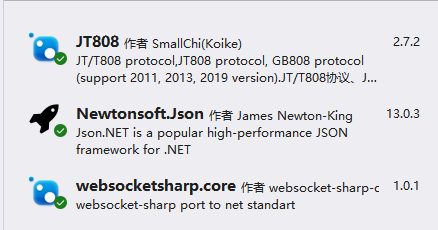

# JT808-Server
> ###  一个用于和定位器进行通信的服务端平台Demo（基于JT808协议）
> #### 目前只测试了和单个定位器通信
> #### 定位器 -> JT808 -> 本系统 -> WebSocket (-> Client)
> - 目前已经在云平台上和单个定位器通信测试过
> - 做这个是因为要在unity中进行定位，因此这个程序作为服务端将基于JT808协议的定位器信号发送给unity客户端

## 1、引用

## 2、主要功能
#### 2.1 TCP
- 处理定位器的注册（_0x0100）、鉴权（_0x0102）、位置信息汇报（_0x0200）数据
#### 2.2 Socket
- 将位置信息汇报数据封装后发送给所有连接的Socket Client
#### 2.3 IP配置
- 会在根目录下生成一个IpSetting.json配置文件用来管理ip和端口